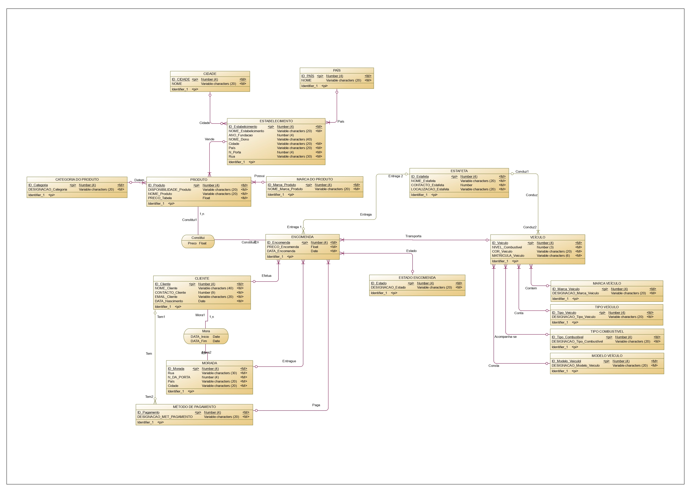
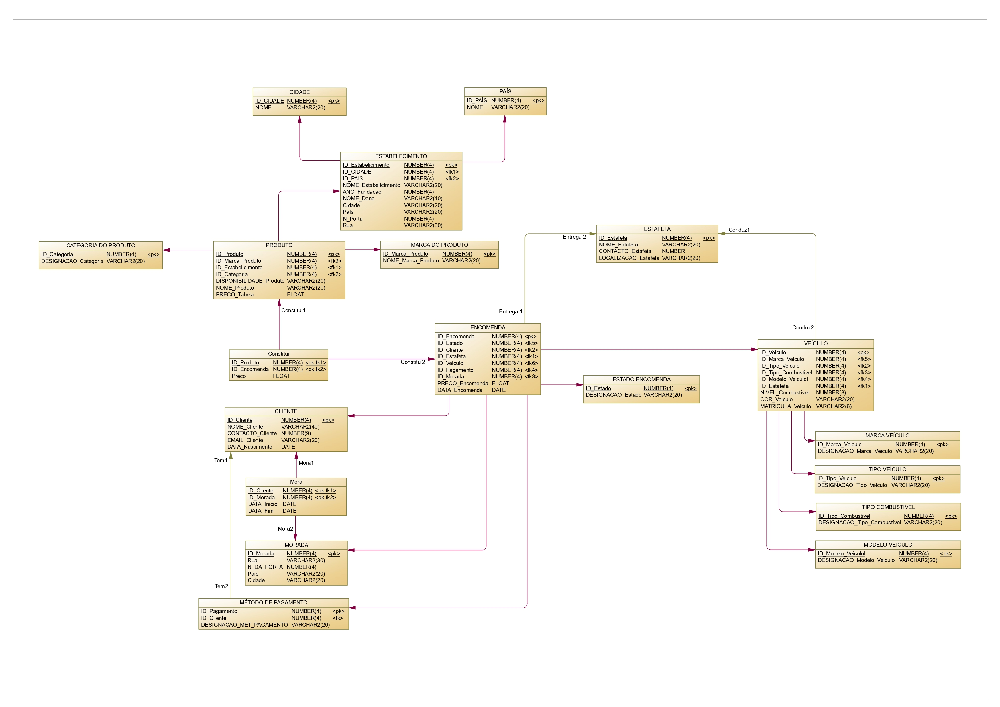

# FastDelivery — Database Management System

A relational database project that models the operations of a **delivery management system**, focusing on order tracking, delivery routing, and customer management.  
Built using **Oracle SQL**, this project demonstrates relational design.

## Overview

**FastDelivery** simulates the internal operations of a parcel delivery company.  
It manages clients, delivery personnel, distribution centers, packages and routes, ensuring that each order is efficiently tracked from dispatch to final delivery.  

The project includes a complete relational schema.

## Technologies Used

- **Oracle Database / SQL Developer** – Database design and implementation  
- **SAP PowerDesigner** – Used to create the conceptual and physical ER models  
- **Entity-Relationship (ER) Modeling** – Conceptual design  
- **Relational Model (3NF)** – Logical schema and normalization  

## Entity-Relationship Diagrams

### Conceptual Model

###  Physical Model

---

*This work was completed as part of the “Databases” course during the 2024/2025 academic year.*

